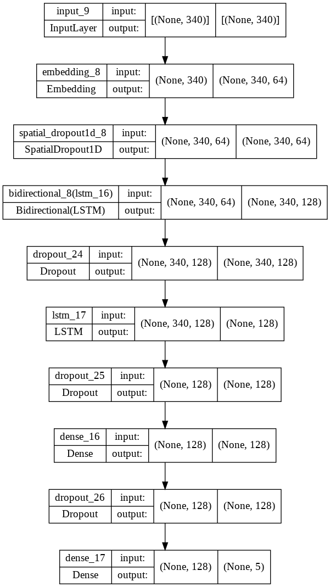
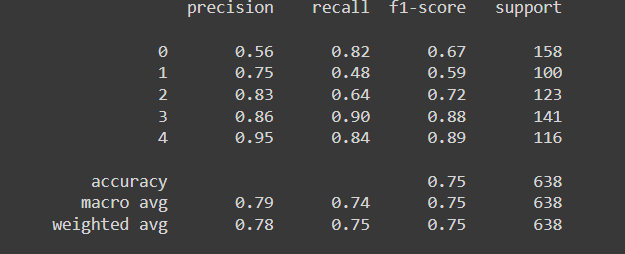
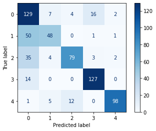
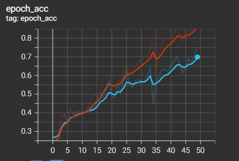
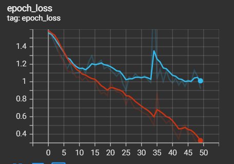

# BBC-news-classification-using-NLP

Sentiment analysis (or opinion mining) is a natural language processing (NLP) technique used to determine whether data is positive, negative or neutral. Sentiment analysis is often performed on textual data to help businesses monitor brand and product sentiment in customer feedback, and understand customer needs.

## Description 
Text documents are essential as they are one of the richest sources of data for businesses. Text documents often contain crucial information which might shape the market trends or influence the investment flows. Therefore, companies often hire analysts to monitor the trend via articles posted online, tweets on social media platforms such as Twitter or articles from newspaper. However, some companies may wish to only focus on articles related to technologies and politics. Thus, filtering of the articles into different categories is required. 

Here, our aim is to categorize unseen articles into 5 categories namely Sport, Tech, Business, Entertainment and Politics.

# Our Aproach

# Step 1) Loading the data:
Data preparation is the primary step for any deep learning problem. The dataset can be obtained from this link [dataset](https://raw.githubusercontent.com/susanli2016/PyCon-Canada-2019-NLP-Tutorial/master/bbc-text.csv) . This dataset consists of a texts that will be use for training. 

           CSV_URL = 'https://raw.githubusercontent.com/susanli2016/PyCon-Canada-\
           2019-NLP-Tutorial/master/bbc-text.csv'

           df = pd.read_csv(CSV_URL)

# Step 2) Data Inspection/Visualization:

           df.head(10)
           df.tail(10)
           df.info()
           df.describe()

           df.duplicated().sum()   # There is 99 duplicated text
           df[df.duplicated()]

# Step 3) Data Cleaning:

           # Remove the duplicated data
           df = df.drop_duplicates()
           df.duplicated().sum()   # Ensure all duplicated have been removed

           text = df['text'].values         # features of X
           category = df['category'].values # target, y
           
# Step 4) Preprocessing:

### 1) Convert into lower case. 

No upper case been detected in text. So, we may skip this process.

### 2) Tokenizing

Here, we would like to change the text into numbers and the process to learn all the words is been done here.

           vocab_size = 10000
           oov_token = 'OOV'
           
           tokenizer = Tokenizer(num_words=vocab_size,oov_token=oov_token)

           tokenizer.fit_on_texts(text)      
           word_index = tokenizer.word_index
           print(word_index)

           train_sequences = tokenizer.texts_to_sequences(text) # To convert into numbers

### 3) Padding & truncating

            length_of_text = [len(i) for i in train_sequences] # list comprehension
            print(np.median(length_of_text))  # to get the number of max length for padding

            max_len = 340

            padded_text = pad_sequences(train_sequences,maxlen=max_len,
                                        padding='post',
                                        truncating='post')

### 4) One Hot Encoding for the target

            ohe = OneHotEncoder(sparse=False)
            category = ohe.fit_transform(np.expand_dims(category,axis=-1))

### 5) Train test split

            X_train,X_test,y_train,y_test = train_test_split(padded_text,category,
                                                             test_size=0.3,
                                                             random_state=123)

            X_train = np.expand_dims(X_train,axis=-1)
            X_test = np.expand_dims(X_test,axis=-1)

# Model Development
By using the model Sequential, LSTM, dropout, SpatialDropout1D, Bidirectional and Dense, Our model development is been structured. The model can be view in `module_sentiment.py` file.

           embedding_dim = 64
           num_feature = np.shape(X_train)[1]
           num_class = 5 

           mc = ModelCreation()
           model = mc.simple_lstm_layer(num_feature, num_class, vocab_size,
                                        embedding_dim, drop_rate=0.3, num_node=128)

           model.compile(optimizer='adam', loss='categorical_crossentropy',
                         metrics='acc')

           # Visualizing the model
           plot_model(model, to_file='model_plot.png', show_shapes=True, 
                      show_layer_names=True)

           # Callbacks
           tensorboard_callback = TensorBoard(log_dir=LOG_FOLDER_PATH)

           # Model training
           hist = model.fit(X_train,y_train, validation_data=(X_test,y_test),
                            epochs=50, batch_size=128, callbacks=[tensorboard_callback])

The visualization of our model architecture can be presented in the figure below:

# Model Evaluation:
Through this section, classification report and confusion matrix is been used as a part of our model evaluation and analysis. Around 75% accuracy have been achieved.

           results = model.evaluate(X_test,y_test)
           print(results)
           y_true = np.argmax(y_test,axis=1)
           y_pred = np.argmax(model.predict(X_test),axis=1)

           cm = confusion_matrix(y_true,y_pred)
           cr = classification_report(y_true,y_pred)
           print(cm)
           print(cr)

           disp = ConfusionMatrixDisplay(confusion_matrix=cm)
           disp.plot(cmap=plt.cm.Blues)
           plt.show()

## Results and Discussion :pencil:

# Plotting the graph 
Although the model is overfitted, there is still a ways to improve the model which is by adding more data to the model.
On the other hand, adding more hidden layer, dropout or increasing the number of nodes might help in preventing the model from overfitted.

## Credits :open_file_folder:

This project is made possible by the data provided from this
[dataset](https://raw.githubusercontent.com/susanli2016/PyCon-Canada-2019-NLP-Tutorial/master/bbc-text.csv)

